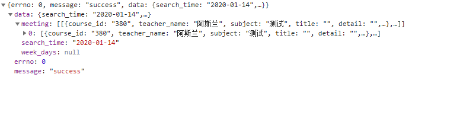

# 课程表项目

课程表的重点是数据的比对及渲染,样式脑补,重点是思路

- 引入`moment.js` [:memo:](http://momentjs.cn/)

``` sh
npm install moment
```

- 数据结构如图



``` html
<!-- 日 -->
<el-col class="ws-week-content">
    <el-col class="ws-timeline" :span="1">
        <div v-for="(hourMinute, index) in dayList[0]" v-bind:key="index">
            {{ hourMinute }}
        </div>
    </el-col>
    <el-col class="ws-panel" :span="23">
        <el-col class="ws-week-sun" v-for="(weekrow, index) in meeting" v-bind:key="index" v-bind:index="index">
            <div class="ws-week-bkg">
                <div v-for="(hourMinute, index) in hoursList[0]" v-bind:key="index" @click="addCourseInfo('ri')">
                        <span v-if="checkNum(weekrow, hourMinute) == 1">
                            <el-popover
                                placement="right"
                                width="240"
                                trigger="hover"
                                >
                                <div>
                                        <el-table
                                        :data="checkList(weekrow, hourMinute)"
                                        style="width: 100%">
                                        <el-table-column
                                            prop="start_time"
                                            label="开始"
                                            width="70"
                                            >
                                        </el-table-column>
                                        <el-table-column
                                            prop="end_time"
                                            label="结束"
                                            width="70"
                                            >
                                        </el-table-column>
                                        <el-table-column
                                            prop="teacher_name"
                                            label="老师"
                                            >
                                        </el-table-column>
                                    </el-table>
                                </div>
                                <el-tag slot="reference" type="success" plain size="mini">{{checkName(weekrow, hourMinute)}}</el-tag>
                            </el-popover>
                        </span>
                        <span v-if="checkNum(weekrow, hourMinute) > 1">
                                <el-popover
                                placement="right"
                                width="450"
                                trigger="hover"
                                >
                                <div>
                                        <el-table
                                        :data="checkList(weekrow, hourMinute)"
                                        style="width: 100%">
                                        <el-table-column
                                            prop="subject"
                                            label="课程名称"
                                            >
                                        </el-table-column>
                                        <el-table-column
                                            prop="start_time"
                                            label="开始"
                                            width="70"
                                            >
                                        </el-table-column>
                                        <el-table-column
                                            prop="end_time"
                                            label="结束"
                                            width="70"
                                            >
                                        </el-table-column>
                                        <el-table-column
                                            prop="teacher_name"
                                            label="老师"
                                            >
                                        </el-table-column>
                                    </el-table>
                                </div>
                                <el-tag slot="reference" type="danger" plain size="mini">更多课程 ({{checkNum(weekrow, hourMinute)}})</el-tag>
                            </el-popover>
                        </span>
                        <span v-if="checkNum(weekrow, hourMinute) == 0"></span>
                </div>
            </div>
            <div class="ws-week-cols"></div>
        </el-col>
    </el-col>
</el-col>
<!-- 周 -->
<el-row class="ws-week-main">
    <el-row type="flex" class="ws-week-header" justify="space-between">
        <el-col v-for="(header, index) in weekTableHeader" v-bind:key="index">{{ header.date }}</el-col>
    </el-row>
    <el-row class="ws-week-viewport">
        <el-col class="ws-week-content">
            <el-col class="ws-timeline">
                <div v-for="(hourMinute, index) in hoursList[0]" v-bind:key="index">
                    {{ hourMinute }}
                </div>
            </el-col>
            <el-col class="ws-panel" :span="23">
                <el-col class="ws-week-day" v-for="(weekrow, index) in meeting" v-bind:key="index" v-bind:index="index">
                    <div class="ws-week-bkg">
                            <div v-for="(hourMinute, index) in hoursList[0]" v-bind:key="index" @click="addCourseInfo('zhou')">
                                <span v-if="checkNum(weekrow, hourMinute) == 1">
                                        <el-popover
                                        placement="right"
                                        width="240"
                                        trigger="hover"
                                        >
                                        <div>
                                                <el-table
                                                :data="checkList(weekrow, hourMinute)"
                                                style="width: 100%">
                                                <el-table-column
                                                    prop="start_time"
                                                    label="开始"
                                                    width="70"
                                                    >
                                                </el-table-column>
                                                <el-table-column
                                                    prop="end_time"
                                                    label="结束"
                                                    width="70"
                                                    >
                                                </el-table-column>
                                                <el-table-column
                                                    prop="teacher_name"
                                                    label="老师"
                                                    >
                                                </el-table-column>
                                            </el-table>
                                        </div>
                                        <el-tag slot="reference" size="mini">{{checkName(weekrow, hourMinute)}}</el-tag>
                                    </el-popover>
                                </span>
                                <span v-if="checkNum(weekrow, hourMinute) > 1">
                                        <el-popover
                                        placement="right"
                                        width="450"
                                        trigger="hover"
                                        >
                                        <div>
                                                <el-table
                                                :data="checkList(weekrow, hourMinute)"
                                                style="width: 100%">
                                                <el-table-column
                                                    prop="subject"
                                                    label="课程名称"
                                                    >
                                                </el-table-column>
                                                <el-table-column
                                                    prop="start_time"
                                                    label="开始"
                                                    width="70"
                                                    >
                                                </el-table-column>
                                                <el-table-column
                                                    prop="end_time"
                                                    label="结束"
                                                    width="70"
                                                    >
                                                </el-table-column>
                                                <el-table-column
                                                    prop="teacher_name"
                                                    label="老师"
                                                    >
                                                </el-table-column>
                                            </el-table>
                                        </div>
                                        <el-tag slot="reference" type="danger" size="mini">更多课程 ({{checkNum(weekrow, hourMinute)}})</el-tag>
                                    </el-popover>
                                </span>
                                <span v-if="checkNum(weekrow, hourMinute) == 0"></span>
                            </div>
                    </div>
                    <div class="ws-week-cols"></div>
                </el-col>
            </el-col>
        </el-col>
    </el-row>
</el-row>
<!-- 月 -->
<table cellspacing="0" cellpadding="0" class="el-calendar-table">
    <thead>
        <th>周一</th>
        <th>周二</th>
        <th>周三</th>
        <th>周四</th>
        <th>周五</th>
        <th>周六</th>
        <th>周日</th>
    </thead>
    <tbody>
        <tr class="el-calendar-table__row" v-for="(week, weekIndex) in dates" :key="weekIndex">
            <td :class="[date.class]" v-for="(date, dateIndex) in dates[weekIndex]" :key="dateIndex">
                <div class="el-calendar-day">
                    <em>{{ date.day }}</em>
                    <div v-for="item in meeting">
                            <template v-if="calendarNum(item, date, headerContent, date.ismonth) == 1">
                                    <el-popover
                                            placement="right"
                                            width="240"
                                            trigger="hover"
                                            >
                                            <div>
                                                    <el-table
                                                    :data="calendarName(item, date, headerContent)"
                                                    style="width: 100%">
                                                    <el-table-column
                                                        prop="start_time"
                                                        label="开始"
                                                        width="70"
                                                        >
                                                    </el-table-column>
                                                    <el-table-column
                                                        prop="end_time"
                                                        label="结束"
                                                        width="70"
                                                        >
                                                    </el-table-column>
                                                    <el-table-column
                                                        prop="teacher_name"
                                                        label="老师"
                                                        >
                                                    </el-table-column>
                                                </el-table>
                                            </div>
                                            <el-tag slot="reference" size="mini" v-for="(items, index) in calendarName(item, date, headerContent)" :key="index">{{items.subject}}</el-tag>
                                        </el-popover>
                            </template>
                            <div v-if="calendarNum(item, date, headerContent, date.ismonth) > 1">
                                    <el-popover
                                        placement="right"
                                        width="450"
                                        trigger="hover"
                                        >
                                        <div>
                                            <el-table
                                                :data="calendarName(item, date, headerContent)"
                                                style="width: 100%">
                                                <el-table-column
                                                    prop="subject"
                                                    label="课程名称"
                                                    >
                                                </el-table-column>
                                                <el-table-column
                                                    prop="start_time"
                                                    label="开始"
                                                    width="70"
                                                    >
                                                </el-table-column>
                                                <el-table-column
                                                    prop="end_time"
                                                    label="结束"
                                                    width="70"
                                                    >
                                                </el-table-column>
                                                <el-table-column
                                                    prop="teacher_name"
                                                    label="老师"
                                                    >
                                                </el-table-column>
                                            </el-table>
                                        </div>
                                        <el-tag slot="reference" type="danger" size="mini">更多课程 ({{calendarNum(item, date, headerContent, date.ismonth)}})</el-tag>
                                    </el-popover>
                            </div>
                            <div v-if="calendarNum(item, date, headerContent, date.ismonth) == 0"></div>
                    </div>
                </div>
            </td>
        </tr>
    </tbody>
</table>
```

``` javascript
data() {
    today: moment().format('YYYY-MM-DD'),
    currentYearMonth: moment().format('YYYY-MM'),
    weekTableHeader: [],
    dates: [],
    hoursList: [],
    headerContent:'',
    currentWeekday: '',
    meeting: [],  
},
methods: {
    // 日历
    calendarNum(list, days, month, ismonth) {
        return list.filter((item) => {
            if (ismonth){
                return item.teach_date == month + '-' + days.day;
            }
        }).length
    },
    calendarName(list, days, month) {
        return list.filter((item) => {
            return item.teach_date == month + '-' + days.day;
        })
    },
    // 周
    checkNum : function(weekrow, hourMinute) {
        return weekrow.filter(function(item) {
            return item.start_time == hourMinute
        }).length
    },
    checkName : function(weekrow,hourMinute) {
        let arr = weekrow.filter(function(item) {
            return item.start_time == hourMinute
        })
        return arr[0].subject
    },
    checkList : function (weekrow, hourMinute) {
        return weekrow.filter(function(item) {
            return item.start_time == hourMinute
        })
    },
    // 创建日列表
    createDayList() {
        this.dayList = [];
        for (let days = 0; days < 7; days++) {
            this.dayList.push([])
            let item = ''
            for (let hours = 0; hours < 24; hours++) {
                if (hours % 1 === 0) {
                    if (hours > 9) {
                        item = hours / 1 + ':00';
                        items = hours / 1 + ':30';
                    } else {
                        item = '0' + hours / 1 + ':00';
                        items = '0' + hours / 1 + ':30';
                    }
                } else {
                    item = ''
                }
                this.dayList[days].push(item,items)
            }
        }
    },
    // 创建周列表
    createWeekList() {
        this.headerContent = moment(this.currentWeekday).format('YYYY-MM-DD') + '~' + moment(this.currentWeekday).add(6, 'days').format('YYYY-MM-DD')
        this.getData(this.headerContent)
        this.weekTableHeader = [
            '周一 ',
            '周二 ',
            '周三 ',
            '周四 ',
            '周五 ',
            '周六 ',
            '周日 '
        ]
        // 独立遍历周
        for (let index = 0; index < 7; index++) {
            let item = {}
            item.date = moment(this.currentWeekday).add(index, 'days')
            if (item.date.isSame(this.today, 'days')) {
                item.class = 'today'
            }
            item.date = this.weekTableHeader[index] + item.date.format('(MM-DD)')
            this.weekTableHeader[index] = item
        }
        // 独立遍历小时 hh:mm
        this.hoursList = [];
        for (let hours = 0; hours < 24; hours++) {
            this.hoursList.push([])
            let item = '';
            if (hours % 1 === 0) {
                if (hours > 9) {
                    item = hours / 1 + ':00';
                    items = hours / 1 + ':30';
                } else {
                    item = '0' + hours / 1 + ':00';
                    items = '0' + hours / 1 + ':30';
                }
            } else {
                item = ''
            }
            this.hoursList[0].push(item,items);
        }
    },
    // 创建日历
    createCalendar() {
        this.dates = []
        // 获取当月的一号是星期几 以便来生成上月的日期 填补够42个格子
        const monthFirstDay = moment(
            this.currentYearMonth + '-01',
            'YYYY-MM-DD'
        )
        // 获得一号与第一个格子内应该有的天数距离 这里需要注意的是 weekday 是从周日 为 0 开始的
        let firstDayWeekday = moment(monthFirstDay).weekday()
        if (firstDayWeekday === 0) {
            firstDayWeekday = 7
        }
        let daysDistance = 1 - firstDayWeekday
        for (let weeks = 0; weeks < 6; weeks++) {
            this.dates.push([])
            // 7天
            for (let weekday = 0; weekday < 7; weekday++) {
                // 该对象有两个属性 一个是class属性 还有一个就是日期
                let date = {}
                date.day = moment(monthFirstDay).add(daysDistance, 'days')
                const dayMonth = moment(date.day).month()
                // 是这个月的日期
                if (dayMonth === moment(monthFirstDay).month()) {
                    date.class = 'current'
                    // 日期是今天的高亮
                    if (moment(date.day).isSame(this.today, 'days')) {
                        date.class += 'is-selected is-today'
                    }
                    // 判断
                    date.ismonth = true;
                } else {
                    date.class = 'prev';
                    date.ismonth = false;
                }
                // 将对应的天数格式从01改为1
                date.day = moment(date.day).format('DD')
                this.dates[weeks].push(date)
                daysDistance++
            }
        }
    }
}
```