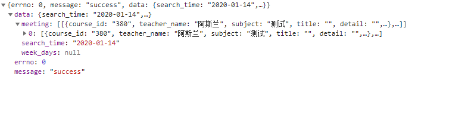
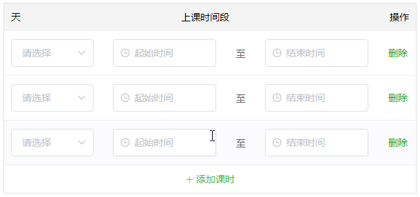

# Vue+ElementUI实战应用

## el-tree的使用

## 课程表项目

课程表的重点是数据的比对及渲染

- 引入`moment.js` [:memo:](http://momentjs.cn/)

``` bash
npm install moment
```

- 数据结构如图



``` html
<!-- 日 -->
<el-col class="ws-week-content">
    <el-col class="ws-timeline" :span="1">
        <div v-for="(hourMinute, index) in dayList[0]" v-bind:key="index">
            {{ hourMinute }}
        </div>
    </el-col>
    <el-col class="ws-panel" :span="23">
        <el-col class="ws-week-sun" v-for="(weekrow, index) in meeting" v-bind:key="index" v-bind:index="index">
            <div class="ws-week-bkg">
                <div v-for="(hourMinute, index) in hoursList[0]" v-bind:key="index" @click="addCourseInfo('ri')">
                        <span v-if="checkNum(weekrow, hourMinute) == 1">
                            <el-popover
                                placement="right"
                                width="240"
                                trigger="hover"
                                >
                                <div>
                                        <el-table
                                        :data="checkList(weekrow, hourMinute)"
                                        style="width: 100%">
                                        <el-table-column
                                            prop="start_time"
                                            label="开始"
                                            width="70"
                                            >
                                        </el-table-column>
                                        <el-table-column
                                            prop="end_time"
                                            label="结束"
                                            width="70"
                                            >
                                        </el-table-column>
                                        <el-table-column
                                            prop="teacher_name"
                                            label="老师"
                                            >
                                        </el-table-column>
                                    </el-table>
                                </div>
                                <el-tag slot="reference" type="success" plain size="mini">{{checkName(weekrow, hourMinute)}}</el-tag>
                            </el-popover>
                        </span>
                        <span v-if="checkNum(weekrow, hourMinute) > 1">
                                <el-popover
                                placement="right"
                                width="450"
                                trigger="hover"
                                >
                                <div>
                                        <el-table
                                        :data="checkList(weekrow, hourMinute)"
                                        style="width: 100%">
                                        <el-table-column
                                            prop="subject"
                                            label="课程名称"
                                            >
                                        </el-table-column>
                                        <el-table-column
                                            prop="start_time"
                                            label="开始"
                                            width="70"
                                            >
                                        </el-table-column>
                                        <el-table-column
                                            prop="end_time"
                                            label="结束"
                                            width="70"
                                            >
                                        </el-table-column>
                                        <el-table-column
                                            prop="teacher_name"
                                            label="老师"
                                            >
                                        </el-table-column>
                                    </el-table>
                                </div>
                                <el-tag slot="reference" type="danger" plain size="mini">更多课程 ({{checkNum(weekrow, hourMinute)}})</el-tag>
                            </el-popover>
                        </span>
                        <span v-if="checkNum(weekrow, hourMinute) == 0"></span>
                </div>
            </div>
            <div class="ws-week-cols"></div>
        </el-col>
    </el-col>
</el-col>
<!-- 周 -->
<el-row class="ws-week-main">
    <el-row type="flex" class="ws-week-header" justify="space-between">
        <el-col v-for="(header, index) in weekTableHeader" v-bind:key="index">{{ header.date }}</el-col>
    </el-row>
    <el-row class="ws-week-viewport">
        <el-col class="ws-week-content">
            <el-col class="ws-timeline">
                <div v-for="(hourMinute, index) in hoursList[0]" v-bind:key="index">
                    {{ hourMinute }}
                </div>
            </el-col>
            <el-col class="ws-panel" :span="23">
                <el-col class="ws-week-day" v-for="(weekrow, index) in meeting" v-bind:key="index" v-bind:index="index">
                    <div class="ws-week-bkg">
                            <div v-for="(hourMinute, index) in hoursList[0]" v-bind:key="index" @click="addCourseInfo('zhou')">
                                <span v-if="checkNum(weekrow, hourMinute) == 1">
                                        <el-popover
                                        placement="right"
                                        width="240"
                                        trigger="hover"
                                        >
                                        <div>
                                                <el-table
                                                :data="checkList(weekrow, hourMinute)"
                                                style="width: 100%">
                                                <el-table-column
                                                    prop="start_time"
                                                    label="开始"
                                                    width="70"
                                                    >
                                                </el-table-column>
                                                <el-table-column
                                                    prop="end_time"
                                                    label="结束"
                                                    width="70"
                                                    >
                                                </el-table-column>
                                                <el-table-column
                                                    prop="teacher_name"
                                                    label="老师"
                                                    >
                                                </el-table-column>
                                            </el-table>
                                        </div>
                                        <el-tag slot="reference" size="mini">{{checkName(weekrow, hourMinute)}}</el-tag>
                                    </el-popover>
                                </span>
                                <span v-if="checkNum(weekrow, hourMinute) > 1">
                                        <el-popover
                                        placement="right"
                                        width="450"
                                        trigger="hover"
                                        >
                                        <div>
                                                <el-table
                                                :data="checkList(weekrow, hourMinute)"
                                                style="width: 100%">
                                                <el-table-column
                                                    prop="subject"
                                                    label="课程名称"
                                                    >
                                                </el-table-column>
                                                <el-table-column
                                                    prop="start_time"
                                                    label="开始"
                                                    width="70"
                                                    >
                                                </el-table-column>
                                                <el-table-column
                                                    prop="end_time"
                                                    label="结束"
                                                    width="70"
                                                    >
                                                </el-table-column>
                                                <el-table-column
                                                    prop="teacher_name"
                                                    label="老师"
                                                    >
                                                </el-table-column>
                                            </el-table>
                                        </div>
                                        <el-tag slot="reference" type="danger" size="mini">更多课程 ({{checkNum(weekrow, hourMinute)}})</el-tag>
                                    </el-popover>
                                </span>
                                <span v-if="checkNum(weekrow, hourMinute) == 0"></span>
                            </div>
                    </div>
                    <div class="ws-week-cols"></div>
                </el-col>
            </el-col>
        </el-col>
    </el-row>
</el-row>
<!-- 月 -->
<table cellspacing="0" cellpadding="0" class="el-calendar-table">
    <thead>
        <th>周一</th>
        <th>周二</th>
        <th>周三</th>
        <th>周四</th>
        <th>周五</th>
        <th>周六</th>
        <th>周日</th>
    </thead>
    <tbody>
        <tr class="el-calendar-table__row" v-for="(week, weekIndex) in dates" :key="weekIndex">
            <td :class="[date.class]" v-for="(date, dateIndex) in dates[weekIndex]" :key="dateIndex">
                <div class="el-calendar-day">
                    <em>{{ date.day }}</em>
                    <div v-for="item in meeting">
                            <template v-if="calendarNum(item, date, headerContent, date.ismonth) == 1">
                                    <el-popover
                                            placement="right"
                                            width="240"
                                            trigger="hover"
                                            >
                                            <div>
                                                    <el-table
                                                    :data="calendarName(item, date, headerContent)"
                                                    style="width: 100%">
                                                    <el-table-column
                                                        prop="start_time"
                                                        label="开始"
                                                        width="70"
                                                        >
                                                    </el-table-column>
                                                    <el-table-column
                                                        prop="end_time"
                                                        label="结束"
                                                        width="70"
                                                        >
                                                    </el-table-column>
                                                    <el-table-column
                                                        prop="teacher_name"
                                                        label="老师"
                                                        >
                                                    </el-table-column>
                                                </el-table>
                                            </div>
                                            <el-tag slot="reference" size="mini" v-for="(items, index) in calendarName(item, date, headerContent)" :key="index">{{items.subject}}</el-tag>
                                        </el-popover>
                            </template>
                            <div v-if="calendarNum(item, date, headerContent, date.ismonth) > 1">
                                    <el-popover
                                        placement="right"
                                        width="450"
                                        trigger="hover"
                                        >
                                        <div>
                                            <el-table
                                                :data="calendarName(item, date, headerContent)"
                                                style="width: 100%">
                                                <el-table-column
                                                    prop="subject"
                                                    label="课程名称"
                                                    >
                                                </el-table-column>
                                                <el-table-column
                                                    prop="start_time"
                                                    label="开始"
                                                    width="70"
                                                    >
                                                </el-table-column>
                                                <el-table-column
                                                    prop="end_time"
                                                    label="结束"
                                                    width="70"
                                                    >
                                                </el-table-column>
                                                <el-table-column
                                                    prop="teacher_name"
                                                    label="老师"
                                                    >
                                                </el-table-column>
                                            </el-table>
                                        </div>
                                        <el-tag slot="reference" type="danger" size="mini">更多课程 ({{calendarNum(item, date, headerContent, date.ismonth)}})</el-tag>
                                    </el-popover>
                            </div>
                            <div v-if="calendarNum(item, date, headerContent, date.ismonth) == 0"></div>
                    </div>
                </div>
            </td>
        </tr>
    </tbody>
</table>
```

``` javascript
data() {
    today: moment().format('YYYY-MM-DD'),
    currentYearMonth: moment().format('YYYY-MM'),
    weekTableHeader: [],
    dates: [],
    hoursList: [],
    headerContent:'',
    currentWeekday: '',
    meeting: [],  
},
methods: {
    // 日历
    calendarNum(list, days, month, ismonth) {
        return list.filter((item) => {
            if (ismonth){
                return item.teach_date == month + '-' + days.day;
            }
        }).length
    },
    calendarName(list, days, month) {
        return list.filter((item) => {
            return item.teach_date == month + '-' + days.day;
        })
    },
    // 周
    checkNum : function(weekrow, hourMinute) {
        return weekrow.filter(function(item) {
            return item.start_time == hourMinute
        }).length
    },
    checkName : function(weekrow,hourMinute) {
        let arr = weekrow.filter(function(item) {
            return item.start_time == hourMinute
        })
        return arr[0].subject
    },
    checkList : function (weekrow, hourMinute) {
        return weekrow.filter(function(item) {
            return item.start_time == hourMinute
        })
    },
    // 创建日列表
    createDayList() {
        this.dayList = [];
        for (let days = 0; days < 7; days++) {
            this.dayList.push([])
            let item = ''
            for (let hours = 0; hours < 24; hours++) {
                if (hours % 1 === 0) {
                    if (hours > 9) {
                        item = hours / 1 + ':00';
                        items = hours / 1 + ':30';
                    } else {
                        item = '0' + hours / 1 + ':00';
                        items = '0' + hours / 1 + ':30';
                    }
                } else {
                    item = ''
                }
                this.dayList[days].push(item,items)
            }
        }
    },
    // 创建周列表
    createWeekList() {
        this.headerContent = moment(this.currentWeekday).format('YYYY-MM-DD') + '~' + moment(this.currentWeekday).add(6, 'days').format('YYYY-MM-DD')
        this.getData(this.headerContent)
        this.weekTableHeader = [
            '周一 ',
            '周二 ',
            '周三 ',
            '周四 ',
            '周五 ',
            '周六 ',
            '周日 '
        ]
        // 独立遍历周
        for (let index = 0; index < 7; index++) {
            let item = {}
            item.date = moment(this.currentWeekday).add(index, 'days')
            if (item.date.isSame(this.today, 'days')) {
                item.class = 'today'
            }
            item.date = this.weekTableHeader[index] + item.date.format('(MM-DD)')
            this.weekTableHeader[index] = item
        }
        // 独立遍历小时 hh:mm
        this.hoursList = [];
        for (let hours = 0; hours < 24; hours++) {
            this.hoursList.push([])
            let item = '';
            if (hours % 1 === 0) {
                if (hours > 9) {
                    item = hours / 1 + ':00';
                    items = hours / 1 + ':30';
                } else {
                    item = '0' + hours / 1 + ':00';
                    items = '0' + hours / 1 + ':30';
                }
            } else {
                item = ''
            }
            this.hoursList[0].push(item,items);
        }
    },
    // 创建日历
    createCalendar() {
        this.dates = []
        // 获取当月的一号是星期几 以便来生成上月的日期 填补够42个格子
        const monthFirstDay = moment(
            this.currentYearMonth + '-01',
            'YYYY-MM-DD'
        )
        // 获得一号与第一个格子内应该有的天数距离 这里需要注意的是 weekday 是从周日 为 0 开始的
        let firstDayWeekday = moment(monthFirstDay).weekday()
        if (firstDayWeekday === 0) {
            firstDayWeekday = 7
        }
        let daysDistance = 1 - firstDayWeekday
        for (let weeks = 0; weeks < 6; weeks++) {
            this.dates.push([])
            // 7天
            for (let weekday = 0; weekday < 7; weekday++) {
                // 该对象有两个属性 一个是class属性 还有一个就是日期
                let date = {}
                date.day = moment(monthFirstDay).add(daysDistance, 'days')
                const dayMonth = moment(date.day).month()
                // 是这个月的日期
                if (dayMonth === moment(monthFirstDay).month()) {
                    date.class = 'current'
                    // 日期是今天的高亮
                    if (moment(date.day).isSame(this.today, 'days')) {
                        date.class += 'is-selected is-today'
                    }
                    // 判断
                    date.ismonth = true;
                } else {
                    date.class = 'prev';
                    date.ismonth = false;
                }
                // 将对应的天数格式从01改为1
                date.day = moment(date.day).format('DD')
                this.dates[weeks].push(date)
                daysDistance++
            }
        }
    }
}
```

## 表单自定义项目

做这个项目的重难点就是不知道怎么读取对应的字段

- 使用嵌套循环进行渲染结构
- 涉及字段读取可以使用`ruleForm[secondIndex.first_field]`的方式来进行读取对应字段中的值

## 后台富文本编辑器

``` html
<!-- 必要样式及脚本 -->
<link rel="stylesheet" href="./resource/css/quill.core.css"/>
<link rel="stylesheet" href="./resource/css/quill.snow.css"/>
<link rel="stylesheet" href="./resource/css/quill.bubble.css"/>
<script type="text/javascript" src="./resource/js/lib/quill.js"></script>
<script type="text/javascript" src="./resource/js/lib/vue-quill-editor.js"></script>
<!-- 第一个 -->
<el-form-item label="活动规则" prop="regular">
    <input type="hidden" name="regular" />
    <quill-editor v-model="activeForm.regular" :options="editorOption" ref="myQuillEditor"></quill-editor>
</el-form-item>
<v8-img-upload :image-upload-visible.sync="showImageSelector" @close="imageSelected" :multiple="false"></v8-img-upload>
<!-- 第二个 -->
<el-form-item label="核心优势" prop="content2">
    <input type="hidden" name="content2" />
    <quill-editor v-model="ele_form.content2" :options="editorOption" ref="myQuillEditor2"></quill-editor>
</el-form-item>
<v8-img-upload :image-upload-visible.sync="showImageSelector2" @close="imageSelected2" :multiple="false"></v8-img-upload>
```

``` javascript
Vue.use(VueQuillEditor);
// data
showImageSelector: false,
currentSelection: null,
editorOption: {
    placeholder: '',
    theme: 'snow',
    modules: {
        toolbar: {
            container: [
                ['bold', 'italic', 'underline', 'strike'],     // toggled buttons
                ['blockquote', 'code-block'],
                [{'header': 1}, {'header': 2}],                // custom button values
                [{'list': 'ordered'}, {'list': 'bullet'}],
                [{'script': 'sub'}, {'script': 'super'}],      // superscript/subscript
                [{'indent': '-1'}, {'indent': '+1'}],          // outdent/indent
                [{'direction': 'rtl'}],                        // text direction
                [{'size': ['small', false, 'large', 'huge']}], // custom dropdown
                [{'header': [1, 2, 3, 4, 5, 6, false]}],
                [{'color': []}, {'background': []}],           // dropdown with defaults from theme
                // [{'font': []}],
                [{'align': []}],
                ['link', 'image', 'video'],
                ['clean']                                      // remove formatting button
            ],
        }
    }
},
// mounted
mounted:function mounted(){
    this.$refs.myQuillEditor.quill.getModule('toolbar').addHandler('image', this.imgHandler);
},
// methods
imgHandler: function imgHandler() {
    this.currentSelection = this.$refs.myQuillEditor.quill.getSelection();
    this.showThumbSelector = true;
    this.showImageSelector = true;
},
imageSelected: function imageSelected(selectedItems) {
    if (selectedItems && selectedItems.length > 0) {
        for (var i = 0; i < selectedItems.length; i++) {
            var item = selectedItems[i];
            var url = item.url;
            this.$refs.myQuillEditor.quill.insertEmbed(this.currentSelection ? this.currentSelection.index : 0, 'image', url, 'user');
        }
    }
},
// data
showImageSelector2: false,
currentSelection2: null,
// mounted
mounted:function mounted(){
    this.$refs.myQuillEditor2.quill.getModule('toolbar').addHandler('image', this.imgHandler2);
},
// methods
imgHandler2: function imgHandler() {
    this.currentSelection2 = this.$refs.myQuillEditor2.quill.getSelection();
    this.showThumbSelector = true;
    this.showImageSelector2 = true;
},
imageSelected2: function imageSelected2(selectedItems) {
    if (selectedItems && selectedItems.length > 0) {
        for (var i = 0; i < selectedItems.length; i++) {
            var item = selectedItems[i];
            var url = item.url;
            this.$refs.myQuillEditor2.quill.insertEmbed(this.currentSelection2 ? this.currentSelection2.index : 0, 'image', url, 'user');
        }
    }
},
```

## Cascader级联组件使用

级联最核心的理解是:props，如果不是自带的字段，就可以用props来指定

``` json
{
    "cityList": [{
        "id": "1",
        "name": "北京",
        "child": {
            "id": "11",
            "name": "大兴区",
            "child": [{
                "id": "111",
                "name": "亦庄"
            }]
        }
    }]
}
```

data中的定义

``` js
data() {
    return {
        optionProps: {
            value: 'id',
            label: 'name',
            children: 'child'
        }
    }
}
```
代码结构
``` html
<!-- selectedOptions 应该是以数组的方式传给后端 -->
<el-cascader 
    :options="cityList" 
    :props="optionProps" 
    v-model="selectedOptions" 
    @change="handleChange">
</el-cascader>
```

## 表格（带时间）添加新的行



``` html
<el-row>
  <el-col class="header">
    <div>天</div>
    <div>上课时间段</div>
    <div>操作</div>
  </el-col>
  <el-table :data="ele_form.weeks">
    <el-table-column>
      <template slot-scope="scope">
        <div class="item">
          <el-select class="form-cw" v-model="scope.row.w" placeholder="请选择">
            <el-option v-for="item in options" :key="item.value" :label="item.label" :value="item.value"></el-option>
          </el-select>
          <el-time-select class="itemw" placeholder="起始时间" v-model="scope.row.start_time" :picker-options="{ start: '00:00', step: '00:30', end: '23:30'}">
          </el-time-select>
          至
          <el-time-select class="itemw" placeholder="结束时间" v-model="scope.row.end_time" :picker-options="{ start: '00:00', step: '00:30', end: '23:30', minTime: scope.row.start_time}"></el-time-select>
          <el-button type="text" @click="handleDelete(scope.$index, ele_form.weeks)">删除</el-button>
        </div>
      </template>
    </el-table-column>
  </el-table>
  <el-col class="item-add">
    <el-button type="text" @click="handleAdd(ele_form.weeks)"><i class="el-icon-plus"></i> 添加课时</el-button>
  </el-col>
</el-row>
```

``` javascript
data: {
    return: {
        // 周一~周日下拉选择数据
        options: [
            {
                value: '1',
                label: '周一',
            },
            {
                value: '2',
                label: '周二',
            },
            {
                value: '3',
                label: '周三',
            },
            {
                value: '4',
                label: '周四',
            },
            {
                value: '5',
                label: '周五',
            },
            {
                value: '6',
                label: '周六',
            },
            {
                value: '0',
                label: '周日',
            }
        ],
        // 返给后端的数据结构
        ele_form: {
            weeks: [
                {
                    w: '',
                    start_time: '',
                    end_time: ''
                }
            ]
        }
    }
},
methods: {
    // 添加新的行，使用数组的push方法
    handleAdd:function(rows) {
        rows.push({w:'',start_time: '',end_time: ''})
    },
    // 删除行，使用splice方法，设置删除一个
    handleDelete:function(index, rows) {
        rows.splice(index, 1)
    },
}
```

## 表格可拖拽重新排列元素顺序

- 引入`sortable.js`

``` bash
npm install sortable.js --save
```

``` html
<el-table :data="tableData"
      border
      row-key="id"
      align="left">
     <el-table-column v-for="(item, index) in col"
        :key="`col_${index}`"
        :prop="dropCol[index].prop"
        :label="item.label"> 
      </el-table-column>
    </el-table>
    <pre style="text-align: left">
      {{dropCol}}
    </pre>
    <hr>
    <pre style="text-align: left">
      {{tableData}}
    </pre>
  </div>
</template>
```

``` javascript
import Sortable from 'sortablejs'
export default {
  data() {
    return {
      col: [
        {
          label: '日期',
          prop: 'date'
        },
        {
          label: '姓名',
          prop: 'name'
        },
        {
          label: '地址',
          prop: 'address'
        }
      ],
      dropCol: [
        {
          label: '日期',
          prop: 'date'
        },
        {
          label: '姓名',
          prop: 'name'
        },
        {
          label: '地址',
          prop: 'address'
        }
      ],
      tableData: [
        {
          id: '1',
          date: '2016-05-02',
          name: '王小虎1',
          address: '上海市普陀区金沙江路 100 弄'
        },
        {
          id: '2',
          date: '2016-05-04',
          name: '王小虎2',
          address: '上海市普陀区金沙江路 200 弄'
        },
        {
          id: '3',
          date: '2016-05-01',
          name: '王小虎3',
          address: '上海市普陀区金沙江路 300 弄'
        },
        {
          id: '4',
          date: '2016-05-03',
          name: '王小虎4',
          address: '上海市普陀区金沙江路 400 弄'
        }
      ]
    }
  },
  mounted() {
    this.rowDrop()
    this.columnDrop()
  },
  methods: {
    //行拖拽
    rowDrop() {
      const tbody = document.querySelector('.el-table__body-wrapper tbody')
      const _this = this
      Sortable.create(tbody, {
        onEnd({ newIndex, oldIndex }) {
          const currRow = _this.tableData.splice(oldIndex, 1)[0]
          _this.tableData.splice(newIndex, 0, currRow)
        }
      })
    },
    //列拖拽
    columnDrop() {
      const wrapperTr = document.querySelector('.el-table__header-wrapper tr')
      this.sortable = Sortable.create(wrapperTr, {
        animation: 180,
        delay: 0,
        onEnd: evt => {
          const oldItem = this.dropCol[evt.oldIndex]
          this.dropCol.splice(evt.oldIndex, 1)
          this.dropCol.splice(evt.newIndex, 0, oldItem)
        }
      })
    }
  }
}
```

## 提交使用for循环遍历拿到新数组

主要思路就是for循环嵌套，将bigListNew的数据与listNew中的数据对比然后匹配的就拿出来形成新的数组（listNew数据是固定的）

``` javascript
onSubmit() {
	let arrFor = [];
    for (let i = 0; i<_this.bigListNew.length; i++) {
        for (let j = 0; j<_this.bigListNew[i].length; j++) {
            for (let k = 0; k<_this.listNew.table.length; k++) {
                if (_this.bigListNew[i][j].id == _this.listNew.table[k].id) {
                    arrFor.push(_this.bigListNew[i][0])
                }
            }
        } 
    }
    console.log(arrFor)
}
```

## Vue数据提交附加新数据

比方说项目完成了，但是需要在增加一个字段，你也不知道后端需要你提交的字段是啥，所以，你可以先预设一个新的字段，最终知道后端字段以后就可以将这个新字段赋给后端接受的字段就可以了

``` javascript
let formData = this.productList;
formData.info = this.info;
// 最终给到data的应该是formData
```

## el-table 内部嵌套数组

使用el-table组件中的（展开行），需要实现一个点击下拉，下拉中展示的内容是一个数组

数据结构如下

``` json
{
    "tableData": [{
        "id": "1",
        "date": "2016-05-02",
        "name": "王小虎",
        "address": "上海市普陀区金沙江路 1518 弄",
        "detail": {
            "one": [{
                    "id": "1",
                    "content": "我是一个好人",
                    "name": "阿星"
                },
                {
                    "id": "3",
                    "content": "我是一个美人",
                    "name": "阿呆"
                }
            ],
            "two": {
                "type": "1",
                "list": ["1", "2", "3"]
            },
            "time": "2019-12-14 08:55:10"
        }
    }]
}
```

HTML结构如下

``` html
<el-table :data="tableData" style="width: 100%">
    <el-table-column label="ID" prop="id"></el-table-column>
    <el-table-column label="姓名" prop="name"></el-table-column>
    <el-table-column label="时间" prop="date"></el-table-column>
    <el-table-column label="地址" prop="address"></el-table-column>
    <el-table-column type="expand" label="操作">
      <template slot-scope="scope">
        <!-- 这里布局展开的内容：start -->
        <div v-for="item in tableData[scope.$index].detail.one" :key="item">
            <div v-if="item.id == 1">
                <!-- 数据模板1 -->
                姓名：{{item.name}}
                座右铭：{{item.content}}
            </div>
            <div v-if="item.id == 2">
                <!-- 数据模板2 -->
                姓名：{{item.name}}
                座右铭：{{item.content}}
            </div>
        </div>
        <div>
            <div v-if="tableData[scope.$index].detail.two.type == 1">
                <!-- 当type=1的时候展示的内容 -->
            </div>
            <div v-else>
                <!-- 当type!=1的时候展示的内容 -->
            </div>
            <!-- two中list数组 -->
            <el-table style="width:100%" :data="tableData[scope.$index].detail.two.list">
                <el-table-column
                    type="index"
                    width="120"
                    label="优先级">
                </el-table-column>
                <el-table-column label="通知项目">
                    <template slot-scope="scope">    
                        <span v-if="scope.row == '1'">校长</span>
                        <span v-if="scope.row == '2'">学生</span>
                        <span v-if="scope.row == '3'">老师</span>
                    </template>
                </el-table-column>
            </el-table>
        </div>
        <div>{{tableData[scope.$index].detail.time}}</div>
         <!-- 这里布局展开的内容：end -->
      <template>
    </el-table-column>
</el-table>
```

## el-table 全选数据只获取id

做一个列表页，勾选列表前面的checkbox只拿当前数据的id拼一个数组，重点代码如下

``` html
<el-table :data="studentList" ref="multipleTable" @selection-change="handleSelectionChange">
    <el-table-column
      type="selection"
      width="55">
    </el-table-column>
</el-table>
```

``` javascript
data() {
    return {
        multipleSelection: []
    }
}
methods: {
    handleSelectionChange(val) {
      if (val) {
        let list = [];
        let listId = [];
        list = val;
        for (let i = 0; i<list.length; i++) {
            listId.push(list[i].id);
        }
        this.multipleSelection = listId;
        console.log(this.multipleSelection)
      }
    }
}
```

## el-checkbox 单个选择成数组的操作

``` html
<el-form-item label="题型选择">
    <el-checkbox v-model="autoRadio" label="1" @change="autoCheckBox(1)">单选</el-checkbox>
    <el-checkbox v-model="autoMany"  label="2" @change="autoCheckBox(2)">多选</el-checkbox>
    <el-checkbox v-model="autoJudge" label="3" @change="autoCheckBox(3)">判断</el-checkbox>
    <el-checkbox v-model="autoBlanks" label="4" @change="autoCheckBox(4)">填空</el-checkbox>
</el-form-item>  
```

``` javascript
var checkTypeList = []; // 全局设置一个数组用来接收

autoCheckBox(type) {
    if (checkTypeList.indexOf(type) == -1) {
        checkTypeList.push(type);
    } else {
        checkTypeList.splice(checkTypeList.indexOf(type), 1);
    }
    this.typeList = checkTypeList;
},
```